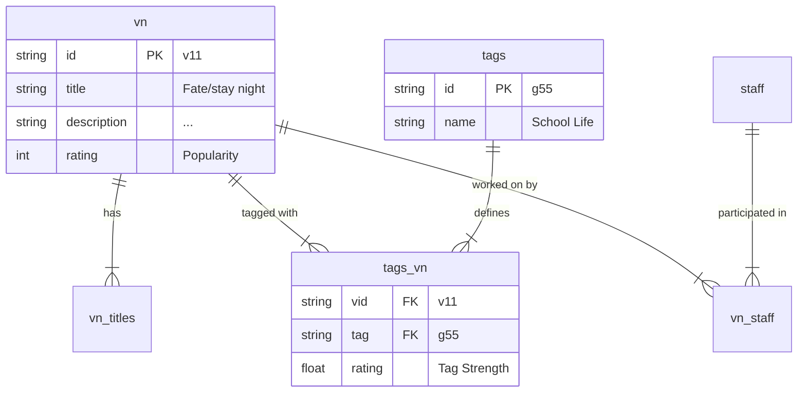

# データベース構造、GIN インデックス、および必要なプログラムについて

ユーザー様からのご質問「JSON ではなく GIN インデックスを使う理由」、「正規化の必要性」、「この DB ダンプの構造と必要なプログラム」について解説します。

## 1. 「GIN インデックス」と「JSONB」の関係

以前話題に出た「GIN インデックス」は、現在のデータベース構造（JSONB 形式）を高速化するための技術です。

- **現状 (JSONB)**: `tags` カラムに `[{"name": "School"}, {"name": "Comedy"}]` のようなデータがそのまま入っています。
- **問題点**: データが 10 万件あると、全ての行の JSON を一つ一つ開いて中身をチェックするため、検索が遅くなります。
- **解決策 (GIN Index)**: 「どのタグがどの行に含まれているか」という目次（インデックス）を作成します。これを使うと、JSON の中身を高速に検索できるようになります。

```sql
-- GINインデックスの作成例
CREATE INDEX idx_tags ON visual_novels USING GIN (tags);
```

※現在の構成のままで検索を速くしたい場合は、この技術を使います。

## 2. DB ダンプの構造（正規化されたリレーショナルデータ）

提供されたダンプファイル (`vndb-db-2026-01-10`) は、JSONB ではなく **「正規化 (Normalization)」** された構造をしています。これは、データを整理整頓して重複をなくした形です。

### 構造のイメージ図



- **`vn` テーブル**: ゲームの基本情報だけが入っています。タグ情報はここにはありません。
- **`tags` テーブル**: タグの名前と ID のリストです（例: ID `g55` = "School Life"）。
- **`tags_vn` テーブル**: 「どのゲーム(`vid`)に、どのタグ(`tag`)がついているか」という紐付け情報だけが入っています。

この構造にすると、**「タグ ID `g55` がついている `vid` を全部ちょうだい」** という検索が爆速になります。これが「正規化が必要」と言われる理由です。

## 3. 必要なプログラム（どんなプログラムを作るべきか）

このダンプファイルを活用するには、以下の 2 種類のプログラムが必要になります。

### A. インポート用プログラム (Importer)

ダンプファイルを PostgreSQL データベースに流し込むためのプログラム（スクリプト）です。
今回提供されている `import.sql` がまさにそれです。

- **言語**: SQL, Bash (コマンドライン)
- **処理**: `psql` コマンドを使って、各テキストファイルの中身をデータベースのテーブルにコピーします。

### B. 変換・利用プログラム (Application / ETL)

取り込んだデータを、Web サイトで使いやすくするためのプログラムです。
「正規化されたデータ」は検索に強いですが、表示するときには「結合（JOIN）」が必要で扱うのが少し面倒です。
そこで、**「正規化データを検索し、JSONB などの扱いやすい形に変換して保存し直す」** アプローチがよく取られます。

**Python での実装イメージ:**

```python
# 1. 正規化されたテーブルからデータを結合して取得
cursor.execute("""
    SELECT v.id, v.title, array_agg(t.name) as tags
    FROM vn v
    JOIN tags_vn tv ON v.id = tv.vid
    JOIN tags t ON tv.tag = t.id
    WHERE t.name = 'School Life'
    GROUP BY v.id
""")

# 2. 取得した結果を、Webアプリ用のテーブルに保存（またはキャッシュ）
for row in cursor.fetchall():
    save_to_frontend_db(row)
```

## 結論

1.  **GIN インデックス**: 「現在の JSONB 形式のまま」検索を速くするための特効薬です。
2.  **正規化（DB ダンプ）**: データの整理整頓です。複雑な検索（例：「タグ A とタグ B を持っていて、声優 C が出ている作品」）をするなら、こちらの形式を取り込むのが正解です。
3.  **作るべきもの**:
    - まずは `import.sql` を使ってダンプを DB に取り込む。
    - 次に、そこから必要なデータを引っ張ってきて整形する Python プログラム を作るのが良いでしょう。
