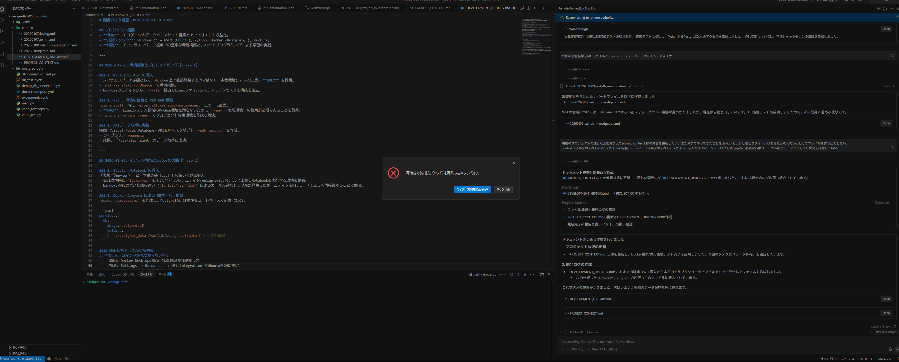

# 【WSL2】VS Code (Antigravity) の接続が頻繁に切れる現象を「.wslconfig」で解決した話

開発中に「Reconnecting to remote...」というポップアップが頻発し、まともに作業ができなくなる現象に遭遇しました。
調査から解決までの一連の流れをまとめます。


## 0. 前提環境

- **OS**: Windows 11 Home/Pro
- **実行環境**: WSL2 (Ubuntu 22.04 LTS)
- **エディタ**: Antigravity / Cursor / VS Code (Remote - WSL拡張機能を使用)
- **ミドルウェア**: Docker Desktop for Windows (WSL integration有効)
  - PostgreSQL 15 コンテナを稼働中

## 1. 発生したトラブル

開発中、エディタ側に以下のような症状が発生しました。

- 頻繁に **"Attempting to reconnect..."** という通知が出て操作不能になる。
- ターミナルでコマンドを打っている最中に固まる。
- Dockerコンテナが勝手に再起動している（ログに不正シャットダウンの痕跡 `database system was not properly shut down` がある）。

## 2. 原因：メモリという「作業台」の奪い合い

WSL2 (Linux) は、デフォルトの設定だと **「空いているメモリ（作業台）には、とりあえず資料（キャッシュ）を広げておこう」** という動作をします。
これは「次回使う時に速いから」というLinuxなりの親切心なのですが、広げすぎて作業台が埋まってしまうことがあります。

この状態で、メモリを多く使うアプリ（VS Code ServerやDockerなど）が「俺も作業したい！」とやってくると、場所がなくて弾かれてしまいます。これが「接続切れ」や「強制終了」の正体でした。

## 3. 解決策：`.wslconfig` で作業台を確保する

Windows側のユーザーホームディレクトリに `.wslconfig` という設定ファイルを置くことで、WSL2が使ってよいリソースの上限（と下限）を制御できます。
これは単に制限するだけでなく、**「この分の作業スペースは確実に確保しておく」** という意味合いもあります。

### 設定手順

1. 以下のパスにテキストファイルを作成する。
   `C:\Users\<Windowsユーザー名>\.wslconfig`

2. 内容を記述する。
   **PCの実装メモリに合わせて調整してください。**

   #### パターンA：メモリ16GB以下のPC（制限重視）
   Windows側を圧迫しないよう、控えめに設定します。
   ```ini
   [wsl2]
   memory=6GB
   swap=2GB
   localhostForwarding=true
   ```

   #### パターンB：メモリ32GB以上のPC（パフォーマンス重視）
   Windowsにも余裕があるので、WSLに十分なリソースを与えて安定させます。
   今回はこちらを採用しました。
   ```ini
   [wsl2]
   memory=12GB # 十分な広さを確保
   swap=8GB    # 万が一あふれた時の保険も厚くする
   localhostForwarding=true
   ```

3. 設定の反映
   PowerShell で以下のコマンドを実行して、WSLを再起動させます。
   ```powershell
   wsl --shutdown
   ```

### 結果

設定適用後、頻発していた「再接続」のポップアップは消え、Dockerコンテナも安定して稼働するようになりました。
`free -h` コマンドで確認すると、メモリ総量 (`total`) が設定どおり約6GBになっていることがわかります。

## まとめ

WSL2でDockerや重い開発ツールを使う場合は、デフォルト設定任せにせず **「この箱（WSL）にはこれだけのスペックを与える」** と明示的に定義してあげるのが、安定運用のコツでした。

同じような「謎の接続切れ」に悩んでいる方は、ぜひ `.wslconfig` を見直してみてください。
